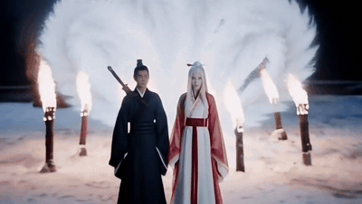
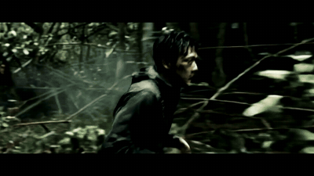

# ai-film-skills

**本地 AI 短片的导演经验库** — 六个 Claude Skill，管的是「这一部片该怎么想」，不是「工具怎么装」。

[English](./README.md) · [成片画廊](./docs/gallery.md) · [两类 skill 的区别](./docs/how-skills-differ.md) · [12 GB 跑 MiniMax H3](./docs/minimax-h3-local-deploy.md) · [出处](./ATTRIBUTION.md)

> **装上就能用。** 最省事的办法：把这句话丢给 Claude Code ——
> 「帮我装一下这个 skill：https://github.com/L-Trunks/ai-film-skills，clone 下来跑 install.sh 就行」
> 装完说一句「做一部短片」就会触发。skill 本体是方法论和知识，不依赖任何脚本或模型。
>
> 想跑仓库里的参考实现，改 `examples/scripts/config.py` 的三个路径，
> 先 `python doctor.py` 体检一遍。

---

## 先看片

两部，全部产自一张 **RTX 4070 Ti（12 GB）**，生成环节无云端 API。

下面是片段动图（无声）。**完整版带声音**：
▶ [九尾](./docs/assets/jiuwei.mp4) · [山海](./docs/assets/shanhai.mp4)

### 《九尾》— long-shot 链式长片，58 段接成一部



尾帧接首帧，同一角色贯穿。旁白与字幕后期配，BGM 一条贯穿。
生成量 **57 段次 / 5 小时 GPU 时间**，其中 17 段废掉重来。

### 《山海》— short-shot 预告片



**全片没有一只异兽出现全身**——只拍痕迹。这不是风格选择，是被模型逼出来的：
山海经异兽没有真实照片作底，正面拍必假，30 镜砸 6 镜。

> 更多分镜与说明见 [成片画廊](./docs/gallery.md)。

---

## 这个仓库解决什么

用 AI 做短片，卡住人的从来不是「怎么调 API」，而是这三件事：

**① 每部片都长一个样。**
你写过一次成功的结构，之后所有片子都会不自觉地套它。我自己就翻过车——四部预告片（一部《山海》+ 三部 SCP）拿去逐镜比对，第 25 镜全是「摘掉面罩，近乎全黑」，第 36 镜全是「大远景空景收尾」。在文档里写「每次要不同」完全没用，我写了，照样撞。

**② 踩过的坑没地方记。**
「柔焦叠加在 YUV 空间会让整片泛品红」「凡是写『某物不在场但留下痕迹』，模型必然把那个某物画出来」——这类经验搜不到、问不出来，只能自己烧显卡换。烧完不记下来，三个月后再踩一遍。

**③ 参数和模型焊死。**
「单镜 2.04 秒是硬约束」——这句话只对 LTX-2.3 成立。换个模型全部作废，但文档里看不出哪些是物理定律、哪些只是我这台机器的属性。

---

## 三个对策

### 反同质化：正交变量表 + 双层指纹

开片前必须填五个正交维度，且必须和最近的片子拉开距离：

| 维度 | 取值 |
|---|---|
| 时间结构 | 线性 / 倒叙 / 循环 / 平行切 / 单时刻切片 |
| 视点 | 全知 / 跟随单人 / 监控·仪器 / 物的视角 / 缺席 |
| 节奏型 | 匀速 / 加速爆发 / 前紧后松 / 两次呼吸 / 全片凝滞 |
| 声音 | BGM通铺 / 音效驱动 / 环境声 / 完全静音 / 声画错位 |
| 结尾 | 空景收 / 回到首镜 / 硬切黑 / 悬而未决 / 日常化 |

但**光查这张表拦不住真正的重复**。SCP 那三部的高层选择完全可以填得不一样，成片照样逐镜同构——因为重复发生在「段落功能 → 具体镜头」这一层。

所以指纹记两层，分层拦截：

```
vars       撞 ≥3 维  →  重选（硬拦）
structure  与近 3 部相同  →  须给出显式理由
signature  撞 ≥2 项  →  重设计（不论 vars 是否已不同）
```

`signature` 记的是开场景别、结尾景别、高潮手法、爆发段模式这些具体设计。第三条才是真正拦住 SCP 问题的那道门。

剪辑骨架也从「唯一真理」降级成候选之一，头部标着使用记录：

```yaml
used_by: [山海, SCP-收容失效, SCP-站点档案, SCP-异常现场]
use_count: 4
```

看到 `use_count: 4`，下次自然会换一套。这比写「请勿重复使用」有效得多。

### 换模型：profile + 自测标定

所有模型相关的数从正文外提到 profile，公式改用变量：

```
镜头数 = (目标秒数 - 转场) / (max_shot_sec - 转场)
                                 ↑ 变量，不再是写死的 2.0417
```

仓库里**只有一份 profile 有真实数据**，就是我实测的 `ltx-2.3-q4-12g`。Wan / HunyuanVideo / 可灵 / 即梦 的参数我不写——没跑过，写了就是抄文档，抄错了反而害人。

给你的是**空白模板 + 五步标定流程**，测出你自己那几个数：

| 要测的 | 怎么测 |
|---|---|
| `max_shot_sec` | 固定一张关键帧跑 2s/3.5s/5s，看主体何时开始漂出画面，取前一档 |
| `align_to` | 故意给非整除宽高看报错，或从 VAE 配置读压缩率 |
| `restart_each_shot` | 连跑两条，看第二条会不会 OOM、采样速度掉不掉 |
| `text_sensitivity` | 主体里写个招牌/菜单，跑 3 次数乱码次数 |
| `motion_style` | 写一句「她慢慢转头看向窗外」，看会不会执行过头 |

### 踩坑经验：单独成篇，可直接引用

`knowledge/pitfalls.md` 是这个仓库真正的核心资产。几条样例：

- **柔焦链必须在 RGB 空间** — `blend=screen` 是逐平面运算，在 YUV 下会把 U/V 色度平面也 screen，整片泛品红。整条链走 `format=gbrp`，出口再转 `yuv420p`。
- **缺席表达必然失败** — 写「空椅子上坐过的凹陷」，模型给你画个人坐在上面。否定句必须逐项列全：「椅子上没有人，画面里没有任何人体、四肢或衣物」。
- **画面里不要有文字载体** — 负向写「排除文字水印」拦不住主体描述里的文字。招牌 / 菜单 / 标签 / 包装 / 路牌，**改法是换主体，不是加负向**。
- **戏剧强度越高越假** — 火山喷发、冰川崩塌是 AI 过拟合区，训练集全是渲染图，一出必带 AI 味。普通瞬间才真。
- **人脸一致性阈值是 0.28，不是 0.5** — AI 生成的同一角色，嵌入余弦相似度天然比真人照片低。照搬真人经验值会把全部合格图判成不合格。
- **提示词里的文字会被画进画面** — 不只是引号里的台词。同一段连撞三次，依次画出了旁白原句、配角描述里的「二十五六岁」、动作描述里的「行了个礼」。**数字风险最高**，而末尾写「画面无文字无水印」完全无效。
- **通用超分会拧坏小人脸** — 人脸短边 < 110px 时，ESRGAN 会把五官熔成一团、脸上长出十字伪纹理；> 150px 则无害。修法要在生成阶段：**提高生成分辨率**最直接（0.3 MP 提到 0.5 MP 是 1.30 倍线性放大，86px 的脸变 112px，且只需给脸小的那几段提）；脸 < 60px 的则必须改景别。按段分治只是都来不及时的兜底 —— 它做的是「不去编造」，不是「修好」。
- **人脸修复对奇幻角色是负资产** — CodeFormer 把「浅琥珀金瞳」改成灰蓝色，`fidelity=0.9` 都拦不住。它对「正常人脸」的先验太强。
- **concat 之后必须重建时间戳** — 不加 `setpts=N/FPS/TB`，编码器会静默丢帧（实测 6062 → 6013），而且丢帧累积，音画越到后面偏得越多。

链式长片（几十段接成一部）另有一整套坑，单独成篇在 `knowledge/chain-consistency.md`：
角色漂移要靠定期重锚定、锚定提示词必须带完整角色描述、空镜绝对不能锚定、
主角的「白发」会渗给同框的所有人。

---

## 六个 skill

一个中枢负责导演总控，五个卫星各管一段，也可以单独触发。

| skill | 管什么 |
|---|---|
| **local-ai-film** ★ | 中枢。开片仪式（profile → 变量表 → 指纹）、踩坑库、执行流程 |
| emotion-to-camera-language | 「氛围感」翻译成光位 / 景深 / 机位 / 人物状态 |
| lock-character-reference | 角色基准形象锁定，跑不稳时怎么办 |
| shot-breakdown | 批量出图后怎么筛，抽几次该停手 |
| rhythm-density | 镜间秒数排布，疏密对比 |
| material-driven-storyboard | 手上没有对应素材时，怎么倒推分镜 |

开片流程：

```
1.  选 profile        → profiles/
2.  掷变量表          → directing/variables.md
3.  查指纹            → directing/fingerprint.md   ← 撞维即重来
4.  选/写骨架         → directing/structures/
5.  算镜头数 / 段数    → 公式取 profile 变量
6.  写分镜            → prompt-craft.md 或 shot-list-prompt.md
7.  出探针            → shot-breakdown
8.  跑批              → examples/scripts/
9.  后期总装          → knowledge/post-production.md
10. 验收              → knowledge/pitfalls.md 逐条查
11. 写回指纹          → films.jsonl                ← 闭环，漏了下次就查不到
```

第 1–3 步没走完，中枢不会让你进第 6 步。第 11 步是闭环，漏了整个机制静默失效。

### 两条正交的分叉

**按模型分族**（profile 的 `family`）：

| | short-shot | long-shot |
|---|---|---|
| 代表 | LTX、Wan | MiniMax H3 |
| 单次产出 | 一个连续镜头 2–5 秒 | 一个含 1–3 镜的段落 5–15 秒 |
| 段内硬切 | 不存在 | 有效 |

两族的知识**互相矛盾**：动作弧线、文字载体、关系性动作的写法在两边结论相反，
读知识库前先确认自己在哪一族。

**按生产模式**：一次性（氛围片、预告片）还是链式（剧情片，尾帧接首帧、同一角色贯穿）。
链式在两族上都能做，但要额外读 `chain-consistency.md`。

---

## 怎么用

### 第一步：装 skill（到这里就能用了）

**最省事的办法 —— 把这句话丢给 Claude Code：**

```
帮我装一下这个 skill：https://github.com/L-Trunks/ai-film-skills
clone 下来跑一下里面的 install.sh 就行
```

它会自己 clone、执行安装脚本、把六个 skill 放进 `~/.claude/skills/`。
装过一次也没关系，同名目录会先备份再覆盖。

<details>
<summary>想自己动手</summary>

```bash
git clone https://github.com/L-Trunks/ai-film-skills
cd ai-film-skills
bash install.sh                # Windows: powershell -ExecutionPolicy Bypass -File install.ps1
```

加 `--project` 就装到当前项目的 `.claude/skills/` 而不是个人目录。

或者干脆手动拷：

```bash
cp -r skills/* ~/.claude/skills/
```

</details>

装完跟 Claude Code 说「做一部短片」「跑一批氛围视频」就会触发。

**这一步之后 skill 已经完全可用了** —— 它会带着你走开片流程、查指纹避免同质化、
按你的模型选路线、写分镜、避开知识库里那几十个坑。
这些**不依赖任何脚本、模型或显卡**，你用云端 API 出片一样受用。

> **用 Codex 或别的 agent？**
> 它们没有 Claude Code 那套 skill 自动触发机制，但这些文档本身就是纯 Markdown 方法论 ——
> clone 下来，让 agent 读 `skills/local-ai-film/SKILL.md`，一样能带着你走完整个流程，
> 只是需要你每次显式指一下路。

### 第二步（可选）：标定你自己的 profile

```
照 profiles/calibration.md 走五步，本地约 40 分钟
```

不标定也能用，只是**算出来的镜头数和秒数会不准** ——
因为公式取的是 profile 里的 `max_shot_sec`，那是我这台机器测出来的。

### 第三步（可选）：跑仓库里的参考脚本

`examples/scripts/` 是我这台机器的实现。所有机器相关的路径都集中在 `config.py`，
不用翻脚本正文：

```bash
# 三选一
set AIFILM_COMFY=D:\ComfyUI              # ① 环境变量
set AIFILM_PY=D:\conda\envs\comfy\python.exe
set AIFILM_ROOT=E:\我的短片

cp config.py config_local.py             # ② 建本地覆盖文件（已在 .gitignore）
                                         # ③ 或者直接改 config.py 的默认值
```

改完先体检：

```bash
python doctor.py
```

它会逐项检查 ComfyUI 目录、python、ffmpeg、模型文件在不在，
ComfyUI 有没有起来，显存够不够，缺哪项直接告诉你改哪个变量。

---

## 仓库里有两种 skill，格式不一样

不是没统一，是刻意的：

| | 蒸馏型（RIA） | 实操型 |
|---|---|---|
| 代表 | 五个卫星 | local-ai-film |
| 来源 | 从他人内容里蒸馏方法论 | 自己跑出来的 |
| 格式 | R / I / A1 / A2 / E / B | 装配流程 + knowledge + profiles |
| 数值可信度 | `verified: 转述` | `verified: 本机实测` + 硬件标注 |

每条数值都带 `verified` 字段。**「我实测的」和「我从别人那儿听来的」必须分开**，这是这个仓库可信度的基础。

`local-ai-film` 没有被硬塞进 RIA 格式——它是一手经验，没有「原文」可引，套模板只会造出假的引用段。

---

## 致谢与出处

五个卫星 skill 的方法论蒸馏自多位创作者的公开内容。R 段已改写为我自己的表述，原始出处见 [ATTRIBUTION.md](./ATTRIBUTION.md)。

## License

内容部分 CC-BY-4.0，`examples/scripts/` 代码部分 MIT。
