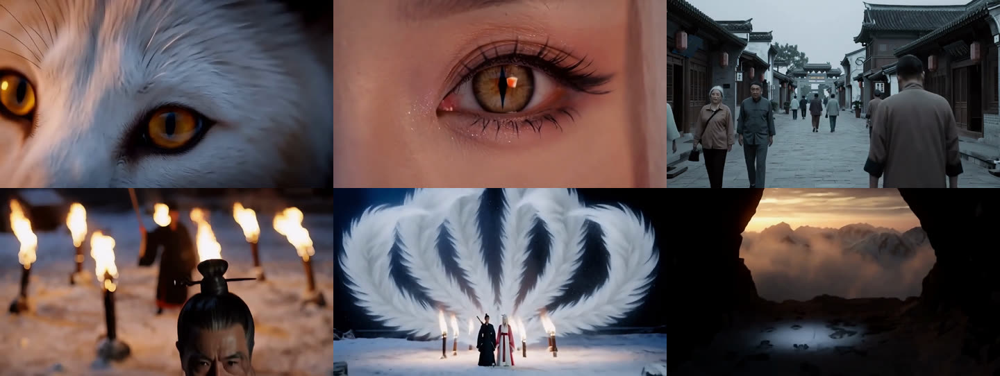
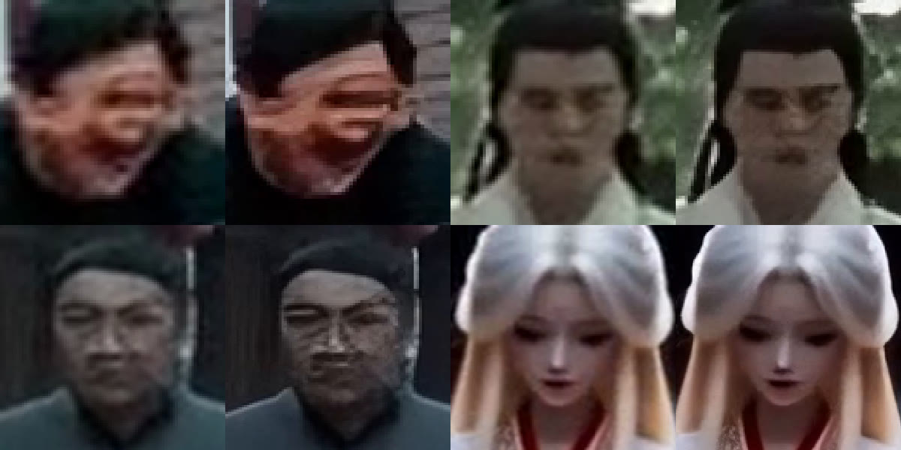
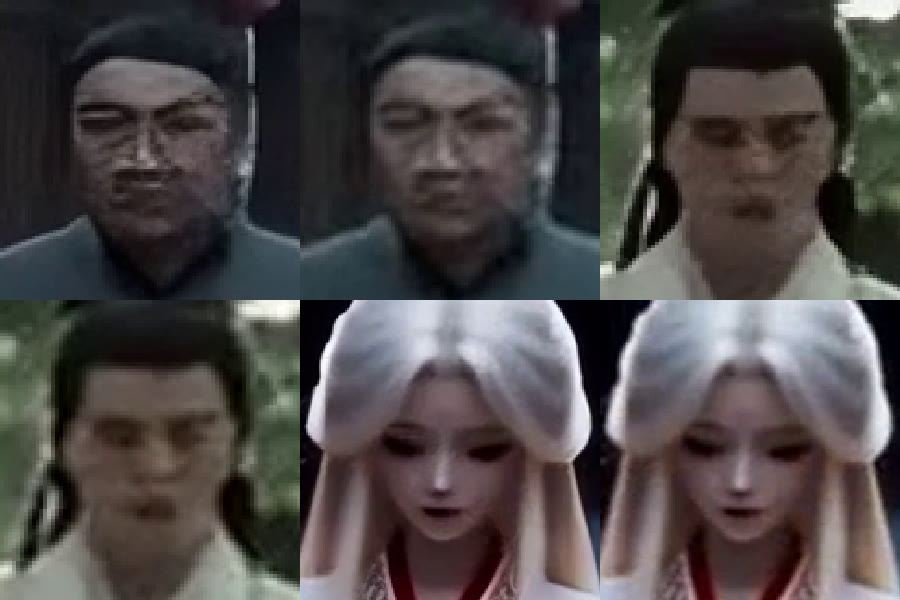
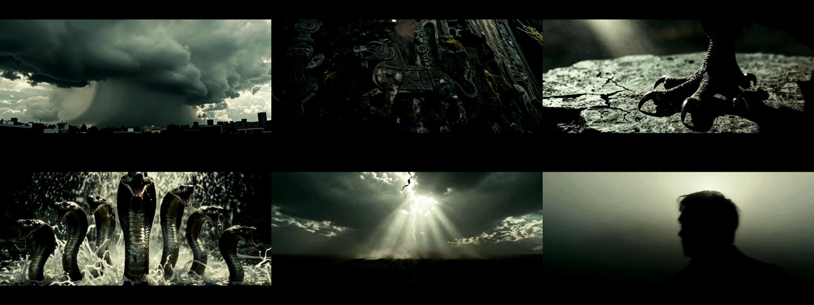

# 成片画廊

全部产自一张 **RTX 4070 Ti（12 GB）**。生成环节无云端 API。

---

## 《九尾》—— long-shot 路线，链式长片

| | |
|---|---|
| profile | `minimax-h3-local` |
| 生产模式 | **链式**（尾帧接首帧，58 段接成一部） |
| 生成分辨率 | 736×416，5.17 秒/段 |
| 成片 | 1472×832（超分后），带旁白与字幕 |
| 生成量 | **57 段次 / 5 小时 GPU 时间**，其中 17 段废掉重来 |

角色由 z-image 出定妆图，H3 以此为参考图链式生成。**结尾那镜是模型自己长出来的** ——
镜头从山洞内部往外拍，前景是雪地上的爪印，而全片第一镜就是雪原上的洞口，
闭环不是写出来的，是它接着上一段的爪印尾帧给的。

这部片贡献了 `knowledge/chain-consistency.md` 一整篇：

| 踩到什么 | 写进哪 |
|---|---|
| 幕内 6 段就把白发漂成黑发 | 每 3 段重锚定 |
| 锚定过的段依然漂 | 锚定提示词只写场景没写角色 |
| 收尾空镜被塞进一个人 | 空镜绝不能锚定 |
| 男主头发也变白了 | 主角属性会渗给同框所有人；配角要有完整定妆 |
| 画面底部出现「二十五六岁」 | 角色描述里不写数字 |
| 接缝一顿一顿 | 尾帧抽的是倒数第 4 帧，不是最后一帧 |

### 按段分治超分

每组左边原生 lanczos 放大，右边 ESRGAN 超分。**人脸短边 < 110 px 时超分是破坏性的** ——
五官熔成一团、脸上长出十字鳞片伪纹理；> 150 px 则无害。

修法不是换更强的超分模型，是**按段分治**：脸小的段走原生放大，其余走超分。
左边纯超分的伪纹理，右边分治后完全消失。段与段之间本来就是切点，看不出来。

---

## 《山海》—— short-shot 路线，预告片

| | |
|---|---|
| profile | `ltx-2.3-q4-12g` |
| 结构 | `trailer-8seg` |
| 成片 | 1920×1080 / 61.6 秒 |

**全片没有一只异兽出现全身。** 风暴、青铜纹、爪压碎石、蛇群、闪电、剪影 ——
只拍痕迹。

这不是风格选择，是被模型逼出来的：山海经异兽没有真实照片作底，
正面拍必假（30 镜砸 6 镜）。于是判据变成了那句写进 `SKILL.md` 的话 ——

> **这个世界里的东西，模型见过真的吗？**

风暴、青铜器、蛇、闪电模型都见过真的；"九头相柳"没有。**戏剧强度越高越假。**

---

## 《自助洗衣店》—— 重构后第一部，20.24 秒 / 14 镜

按完整开片流程产出：`profile → 变量表 → 指纹 → 骨架 → 分镜 → 探针图 → 跑批 → 验收 → 写回`。

| | |
|---|---|
| profile | `ltx-2.3-q4-12g` |
| 变量表 | 循环 · 监控·仪器 · 前紧后松 · BGM通铺 · 回到首镜 |
| 骨架 | `loop-tight`（新写，因两套旧骨架都已 `use_count: 4`） |
| 结构 | 前段 8 镜 × 1.0s（60 次/分）+ 后段 6 镜 × 2.04s（29 次/分），硬切 |
| 题材 | 深夜自助洗衣店监控视角，**全片零人物** |
| 耗时 | 46 分钟 |

首镜与末镜是同一台洗衣机的滚筒舷窗，**全片只有一处改变**：衣物由深蓝变浅黄。

### 这部片替机制抓到的四个问题

| # | 问题 | 被什么拦下 |
|---|---|---|
| 1 | 四部氛围片全是 17 镜 | 建 `films.jsonl` 时统计出来的，此前无人察觉 |
| 2 | `trailer-8seg` / `ambient-flat` 都已用 4 次 | 骨架层 `use_count` → 逼出第三套 |
| 3 | `s07` 洗衣机面板伪 logo + 乱码 | 第 7 步探针图验收 |
| 4 | `s14` 伸进来一只手放衣物 | 成片抽帧验收 |

第 4 条挖出了坑库里最长的一条：**LTX 工作流的 negative 是 `ConditioningZeroOut`，
图生视频阶段根本没有负向通路**。逐项否定重抽两次都没压住（v2 里手不但伸进来还把舱门拉开了），
最终按判停规则改用静止帧。

---

## 重构之前的成片

全部由 `ltx-2.3-q4-12g` profile 产出（RTX 4070Ti 12G）。

### 预告片（2.39:1，53–62 秒）

| 片名 | 镜数 | 结构 | 备注 |
|---|---|---|---|
| 山海 | 41 | `trailer-8seg` | 题材缺训练数据，30 镜砸 6 镜 |
| SCP-收容失效 | 36 | `trailer-8seg` | |
| SCP-站点档案 | 36 | `trailer-8seg` | |
| SCP-异常现场 | 36 | `trailer-8seg` | |

**这四部就是问题本身。** 逐镜对照见 `skills/local-ai-film/directing/fingerprint.md`：第 25 镜全是「摘掉遮脸物 + 近乎全黑」，第 36 镜全是「大远景空景」。

### 氛围片（16:9，约 30 秒）

| 片名 | 镜数 | 结构 | 备注 |
|---|---|---|---|
| 唯美治愈v2 | 17 | `ambient-flat` | |
| 夜班 | 17 | `ambient-flat` | |
| 手上的活 | 17 | `ambient-flat` | 零露脸，纪实感最强 |
| 北方的冬天 | 17 | `ambient-flat` | |

**四部全是 17 镜。** 这是第二处同质化，当初没人注意到，是重构时统计 `films.jsonl` 才发现的。

---

## 语料统计

重构前 8 部片的 signature 分布 —— 这组数字就是双层指纹机制的设计依据：

| 字段 | 重构前 8 部 | 加入《自助洗衣店》后 |
|---|---|---|
| `time` | **线性 8 / 8** | 线性 8、循环 1 |
| `audio` | **BGM通铺 8 / 8** | BGM通铺 9（仍未破） |
| `ending_size` | **大远景 7 / 8** | 大远景 7、中景 1、极特写 1 |
| `tempo` | 匀速 4、加速爆发 4 | + 前紧后松 1 |
| `structure` | `ambient-flat` 4、`trailer-8seg` 4 | + `loop-tight` 1 |
| `shot_count` | 17×4、36×3、41×1 | + 14×1 |

八部片里有**两个维度是 100% 单一取值**（时间结构、声音），一个接近 90%（结尾）。
**变量表里那些标「未自测」的取值就是这么来的** —— 不是没想到，是从来没试过。

新片破了其中四个维度，只有 `audio` 还是 9/9 的 `BGM通铺`：
`环境声` / `完全静音` / `声画错位` 都需要额外音源，本地生成的素材是无声的。
**MiniMax H3 原生带音频，正是破这一维的机会。**

---

## 待办

- [x] ~~按新流程跑一部验证片~~ —— 《自助洗衣店》
- [x] ~~MiniMax H3 本地版跑一部对照片~~ —— 《九尾》，58 段链式长片
- [x] ~~补封面图~~
- [ ] 补 B 站或其他平台的成片外链
- [ ] 破 `audio: BGM通铺` 这一维 —— H3 原生带音频，但长片里生成音频必须整条丢掉重配，
      所以这一维要破得换个思路（环境声 / 声画错位），不是靠 H3 自动解决
- [ ] Wan 档标定（`profiles/wan-2.1-i2v-14b-local.md` 全部字段待填）
