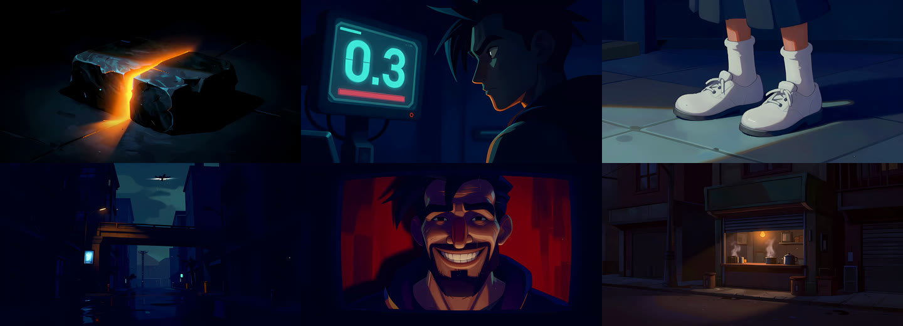
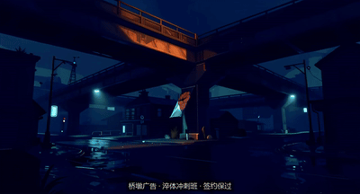

# 成片画廊

全部产自一张 **RTX 4070 Ti（12 GB）**。生成环节无云端 API。

---

## 《我为万界当狱卒》—— long-shot 路线，带对白的剧情片

▶ **[片段（48 秒，有声）](assets/yuzu.mp4)** —— 取自第01–02集的 1'34"–2'22"

| | |
|---|---|
| profile | `minimax-h3-local` |
| 结构 | `episode-drama`（新写的骨架） |
| 生成分辨率 | 736×416，5.17 秒/段 |
| 成片 | 1536×832，第01集 40 镜 / 1'47"，第02集 34 镜 / 1'47" |
| 声音 | H3 原生对白 + 口型，VoxCPM 重配，音效与 BGM 后期分段 |

**这部片解决的是前面几部都绕开了的问题：角色要认得出、话要接得上。**
氛围片可以每镜各美各的（「手上的活」那部干脆 17 镜零露脸），
预告片可以只拍痕迹 —— 剧情片两条路都走不了。

### 它推翻了我们自己的两条结论

**① 「提示词太长导致指令不执行 → 削短它」——** 在这部片上是错的。

同一天另一条人物图产线上，把提示词从 1300 字削到 250 字，四个动作从 0/4 变成 4/4。
把同样的削法搬到这里，**指令确实听话了，画面质量掉一大截**：背景没层次、
模型自己往空处填东西（凭空多一块石头、枪尖倒插进地）。
关键帧要喂给 H3 当首帧，**背景就是整部片的质感底子**，削不得。

真正管用的是**反过来加长**（811–869 token，比原来还多）、只换指令写法：
夹句（核心指令首尾各放一遍）+ 画幅裁切（把构图写成物理上塞不下别的东西）。

> **真变量是「指令句 vs 描述句谁的权重高」，长度只是影响它的一条路径 —— 而且是代价最大的那条。**
> 判据：这张图的背景要不要看？要 → 别削。
> 全部写在 `knowledge/prompt-craft.md` 第六节。

**② 「`audio: BGM通铺`」这一维终于破了。** 历史 8 部片 8/8 都是它。
第一版照旧写成「从某镜起铺到片尾」，实测覆盖 **94%** —— 一直响着等于没响。
破法不是"少放点"，是换判据：**对白交锋的段落一律不给音乐**，降到 19% / 34%。

### 判停清单：模型做不到的，换写法，不要重抽

剧情片最贵的浪费是拿重抽去撞能力边界。六类直接改分镜：

| 做不到 | 换成 |
|---|---|
| 机械开合 | 关着的空镜 **硬切** 开着的空镜 |
| 群体连锁反应 | 单人反应 + 画外声 |
| 走位（走进来、走出画） | 直接画「已到位」 |
| 画内文字 | 只留大号阿拉伯数字（`0.3` `43.7` 能出，中文必糊） |
| 多人互动 | 拆单人镜，用视线缝起来 |
| 手部纹理级特征 | 改成姿势级特征 |

⛔ **但只砍画面不补声音就露馅** —— 砍掉的群体反应、开合声必须还在音轨里。

⚠️ 「走位」这条的边界要说准：**做不到的是位移，不是动作幅度大。**
起立、坐下、转身、弯腰这类原地姿态变化，H3 演得出来。一起砍掉是过度保守。

### 夜里没人时怎么放行：把「我判不准」变成一个数

第 03/04 集要跑通宵，而 H3 一集三小时、每段要重启，中途没法问人。
于是判据全部改成能算的：背对 → 人脸数 == 0；人在画左 → bbox 中心 x；
全景 → 膝/踝关键点 score；黑图 → 像素 std。

⛔ **最要紧的一条是：检查器上岗前先拿历史合格素材跑误杀回归。**
我们拿 59 张已出片的关键帧跑，揪出三类**自己的**假阳性 ——
方向词被当成位置词、贴地拍鞋的镜头检出「8 个人」、过肩镜里量错了人。
不查出来就是整夜按错误判据杀好图。

顺带的收获：这轮回归**独立查出 4 处已出片素材的真实缺陷**。回归也是免费的复检。

完整纪律在 `knowledge/auto-review.md`。

---

## 《九尾》—— long-shot 路线，链式长片

| | |
|---|---|
| profile | `minimax-h3-local` |
| 生产模式 | **链式**（尾帧接首帧，58 段接成一部） |
| 生成分辨率 | 736×416，5.17 秒/段 |
| 成片 | 1472×832（超分后），带旁白与字幕 |
| 生成量 | **57 段次 / 5 小时 GPU 时间**，其中 17 段废掉重来 |

角色由 z-image 出定妆图，H3 以此为参考图链式生成。**结尾那镜是模型自己长出来的** ——
镜头从山洞内部往外拍，前景是雪地上的爪印，而全片第一镜就是雪原上的洞口，
闭环不是写出来的，是它接着上一段的爪印尾帧给的。

这部片贡献了 `knowledge/chain-consistency.md` 一整篇：

| 踩到什么 | 写进哪 |
|---|---|
| 幕内 6 段就把白发漂成黑发 | 每 3 段重锚定 |
| 锚定过的段依然漂 | 锚定提示词只写场景没写角色 |
| 收尾空镜被塞进一个人 | 空镜绝不能锚定 |
| 男主头发也变白了 | 主角属性会渗给同框所有人；配角要有完整定妆 |
| 画面底部出现「二十五六岁」 | 角色描述里不写数字 |
| 接缝一顿一顿 | 尾帧抽的是倒数第 4 帧，不是最后一帧 |

### 按段分治超分

每组左边原生 lanczos 放大，右边 ESRGAN 超分。**人脸短边 < 110 px 时超分是破坏性的** ——
五官熔成一团、脸上长出十字鳞片伪纹理；> 150 px 则无害。

左边纯超分，右边按段分治（脸小的段走 lanczos 原生放大）。伪纹理确实压掉了。

**但要说清楚：分治不是修好，是止损。**

它做的事情只是"不去编造"——脸该糊还是糊，只是从"编错的五官"退回到"看不清的五官"。
在小脸上后者更耐看，仅此而已。超分不可能凭空补出生成时就不存在的信息。

**真正的修法在生成阶段**，按代价从小到大三条：

| | 做什么 | 对什么有效 |
|---|---|---|
| ① | **提高生成分辨率** | 脸 85–110 px 的段。0.3 MP 提到 0.5 MP 是 1.30 倍线性放大，86 px 直接变 112 px |
| ② | 改景别 / 换构图重抽 | 脸 < 60 px 的段 —— 提到 1 MP 也才 91 px，参数救不了 |
| ③ | 换种子重抽 | 构图没问题但这一版画糊了（蜡质感、运动模糊） |

第 ① 条最省事，而且**不必全片都提，只提脸小的那几段** ——
后期反正要统一超分到同一尺寸，各段生成分辨率不一致完全没问题。

本片只做了第 ③ 条（三段），没做 ① 和 ②，纯粹是时间不够。
**分治是这三条都来不及做时的兜底，不是首选。**

---

## 《山海》—— short-shot 路线，预告片

| | |
|---|---|
| profile | `ltx-2.3-q4-12g` |
| 结构 | `trailer-8seg` |
| 成片 | 1920×1080 / 61.6 秒 |

**全片没有一只异兽出现全身。** 风暴、青铜纹、爪压碎石、蛇群、闪电、剪影 ——
只拍痕迹。

这不是风格选择，是被模型逼出来的：山海经异兽没有真实照片作底，
正面拍必假（30 镜砸 6 镜）。于是判据变成了那句写进 `SKILL.md` 的话 ——

> **这个世界里的东西，模型见过真的吗？**

风暴、青铜器、蛇、闪电模型都见过真的；"九头相柳"没有。**戏剧强度越高越假。**

---

## 重构之前的成片

全部由 `ltx-2.3-q4-12g` profile 产出（RTX 4070Ti 12G）。

### 预告片（2.39:1，53–62 秒）

| 片名 | 镜数 | 结构 | 备注 |
|---|---|---|---|
| 山海 | 41 | `trailer-8seg` | 题材缺训练数据，30 镜砸 6 镜 |
| SCP-收容失效 | 36 | `trailer-8seg` | |
| SCP-站点档案 | 36 | `trailer-8seg` | |
| SCP-异常现场 | 36 | `trailer-8seg` | |

**这四部就是问题本身。** 逐镜对照见 `skills/local-ai-film/directing/fingerprint.md`：第 25 镜全是「摘掉遮脸物 + 近乎全黑」，第 36 镜全是「大远景空景」。

### 氛围片（16:9，约 30 秒）

| 片名 | 镜数 | 结构 | 备注 |
|---|---|---|---|
| 唯美治愈v2 | 17 | `ambient-flat` | |
| 夜班 | 17 | `ambient-flat` | |
| 手上的活 | 17 | `ambient-flat` | 零露脸，纪实感最强 |
| 北方的冬天 | 17 | `ambient-flat` | |

**四部全是 17 镜。** 这是第二处同质化，当初没人注意到，是重构时统计 `films.jsonl` 才发现的。

---

## 语料统计

重构前 8 部片的 signature 分布 —— 这组数字就是双层指纹机制的设计依据：

| 字段 | 重构前 8 部 | 重构后新增 |
|---|---|---|
| `time` | **线性 8 / 8** | + 循环 1、**倒叙 1** |
| `audio` | **BGM通铺 8 / 8** | + 旁白+BGM 1（九尾）、**对白驱动 2（狱卒）** |
| `ending_size` | **大远景 7 / 8** | + 中景、近景、极特写 |
| `tempo` | 匀速 4、加速爆发 4 | + 前紧后松 2、变节奏 |
| `structure` | `ambient-flat` 4、`trailer-8seg` 4 | + `loop-tight`、九幕链式、**`episode-drama` 2** |
| `shot_count` | 17×4、36×3、41×1 | + 14、4、80、**40、34** |

八部片里有**两个维度是 100% 单一取值**（时间结构、声音），一个接近 90%（结尾）。
**变量表里那些标「未自测」的取值就是这么来的** —— 不是没想到，是从来没试过。

`audio` 这一维卡了最久 —— 本地生成的素材一直是无声的。
H3 原生带音频**部分**破了它：几秒的短片可以直接用生成的对白和口型；
但长片不行 —— 58 段各自生成的音乐互不相干，必须整条丢掉重配。
所以这一维在长片上仍然要靠后期，只是从"没有音源"变成了"有口型可对"。

**2026-08-20 这一维正式破了**，靠的不是工具而是判据：
《狱卒》两集把 BGM 从"通铺"改成显式段落，规则是**对白交锋的地方一律不给音乐**，
覆盖率 94% → 19% / 34%。前提是声音层有别的东西撑着（对白 + 音效），
否则静下来的段是空的 —— 所以这条要和 `native_audio` 或后期配音配套用。

---

## 待办

- [x] ~~按新流程跑一部验证片~~
- [x] ~~MiniMax H3 本地版跑一部对照片~~ —— 《九尾》58 段链式长片
- [ ] 同一个内容在 short-shot / long-shot 两条路线各跑一遍，两版并排对比
- [x] ~~补封面图~~
- [ ] 补 B 站或其他平台的成片外链
- [x] ~~破 `audio: BGM通铺` 这一维~~ —— 《狱卒》两集，判据换成「对白交锋段不给音乐」
- [x] ~~为 long-shot 写一套自己的骨架~~ —— `episode-drama`
- [ ] Wan 档标定（`profiles/wan-2.1-i2v-14b-local.md` 全部字段待填）
- [ ] **《九尾》漏了第 11 步，`films.jsonl` 里没有它的指纹** —— 本页有全部素材，补一行即可。
      这正好是那句「漏了整套机制静默失效」的现场样本
